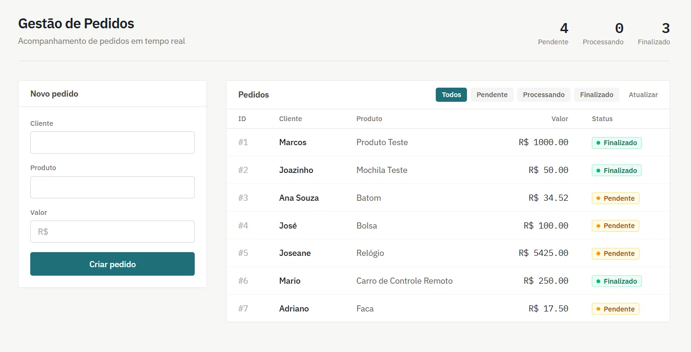
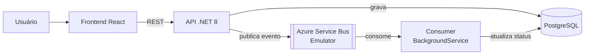
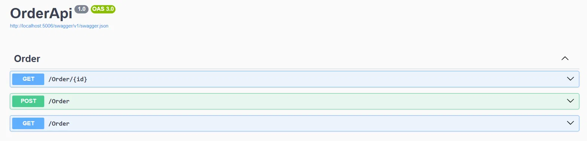

# OrderAPI
 
Sistema de gestão de pedidos com processamento assíncrono via mensageria, construído em .NET 8 + React, containerizado e funcional de ponta a ponta.
 
 


 
## Sobre o projeto
 
Este projeto implementa um fluxo completo de criação e processamento de pedidos: o cliente cria um pedido pela interface web, a API salva no banco e publica um evento numa fila de mensageria, e um worker em background consome essa fila para processar o pedido e avançar seu status automaticamente — sem bloquear a requisição original.
 

 
## Funcionalidades
 
- Criação de pedidos com publicação assíncrona de evento na fila
- Processamento automático em background, avançando o status do pedido: `Pendente` → `Processando` → `Finalizado`
- Consumidor idempotente (mensagens duplicadas não reprocessam um pedido já avançado)
- Listagem de pedidos com filtro por status
- Interface web para criar e acompanhar pedidos em tempo real, com feedback visual de carregamento e confirmação
- Ambiente 100% containerizado — sobe com um único comando, sem depender de conta ou assinatura na nuvem
## Arquitetura
 

 
A API e o worker rodam no mesmo processo (a classe `OrderConsumer` é um `BackgroundService` registrado junto da API), consumindo da mesma fila que a API publica. Essa escolha simplifica a operação para o escopo do projeto; numa arquitetura de maior escala, o consumer seria um serviço separado, escalável de forma independente.
 
## Tecnologias
 
**Backend:** C#, ASP.NET Core 8, Entity Framework Core, Npgsql, Azure.Messaging.ServiceBus
 
**Frontend:** React, Vite, TailwindCSS
 
**Infraestrutura:** PostgreSQL, Azure Service Bus Emulator (via Docker, sem custo e sem necessidade de assinatura Azure), Docker Compose, pgAdmin
 
## Como rodar o projeto
 
### Pré-requisitos
 
- [Docker Desktop](https://www.docker.com/products/docker-desktop/) instalado e em execução
### Subindo tudo com Docker Compose
 
1. Clone o repositório:
```bash
   git clone https://github.com/MarcosVSantosF/Order-API.git
   cd Order-API
```
 
2. Crie o arquivo `.env` na raiz do projeto (ao lado do `docker-compose.yml`):
```env
   CONFIG_PATH=./Backend/ServiceBus/config.json
   ACCEPT_EULA=Y
   MSSQL_SA_PASSWORD=StrongPassword123!
   EMULATOR_HTTP_PORT=5300
```
 
3. Suba todos os serviços:
```bash
   docker compose up --build
```
 
4. Acesse:
   - **Frontend:** http://localhost:5173
   - **API (Swagger):** http://localhost:8080/swagger
   - **pgAdmin:** http://localhost:5050 (login: `admin@admin.com` / `admin`)
> Na primeira subida, o emulador do Service Bus e o SQL Edge (exigido internamente por ele) podem levar um minuto a mais para ficarem prontos. As migrations do banco são aplicadas automaticamente na inicialização da API.
 
### Rodando localmente (sem Docker para API/Frontend)
 
Se preferir rodar o backend e o frontend fora de containers (útil durante desenvolvimento), suba só a infraestrutura:
 
```bash
docker compose up postgres servicebus-emulator mssql -d
```
 
E depois, em terminais separados:
 
```bash
cd Backend
dotnet run
```
 
```bash
cd frontend
npm install
npm run dev
```
 
Nesse modo, configure o `Backend/appsettings.Development.json` (não versionado) com as connection strings apontando para `localhost` em vez dos nomes internos do Docker:
 
```json
{
  "ConnectionStrings": {
    "DefaultConnection": "Host=localhost;Port=5432;Database=ordersdb;Username=postgres;Password=postgres"
  },
  "ServiceBus": {
    "ConnectionString": "Endpoint=sb://localhost:5672;SharedAccessKeyName=RootManageSharedAccessKey;SharedAccessKey=SAS_KEY_VALUE;UseDevelopmentEmulator=true;",
    "QueueName": "orders"
  }
}
```
 
E no `frontend/.env`:
```env
VITE_API_URL=http://localhost:5006
```
(ajuste a porta conforme o `launchSettings.json` do seu ambiente)
 
## Endpoints da API
 


| Método | Rota | Descrição |
|---|---|---|
| `GET` | `/Order` | Lista todos os pedidos (aceita `?status={status}` para filtrar por `Pendente`, `Processando` ou `Finalizado`) |
| `GET` | `/Order/{id}` | Busca um pedido específico pelo ID |
| `POST` | `/Order` | Cria um novo pedido e publica o evento de criação na fila |
 
Documentação interativa completa disponível no Swagger (`/swagger`) com a API em execução.
 

## Possíveis melhorias futuras
 
- Health check customizado para a fila (Postgres já teria suporte via `AspNetCore.HealthChecks.NpgSql`)
- Paginação na listagem de pedidos
- Testes automatizados (unitários no consumer e de integração na API)
- Worker como serviço separado, escalável independentemente da API
## Autor
 
Marcos Vinícius Santos Ferreira 

 [](https://www.linkedin.com/in/marcosviniciussantosferreira) [](https://github.com/MarcosVSantosF)
 
